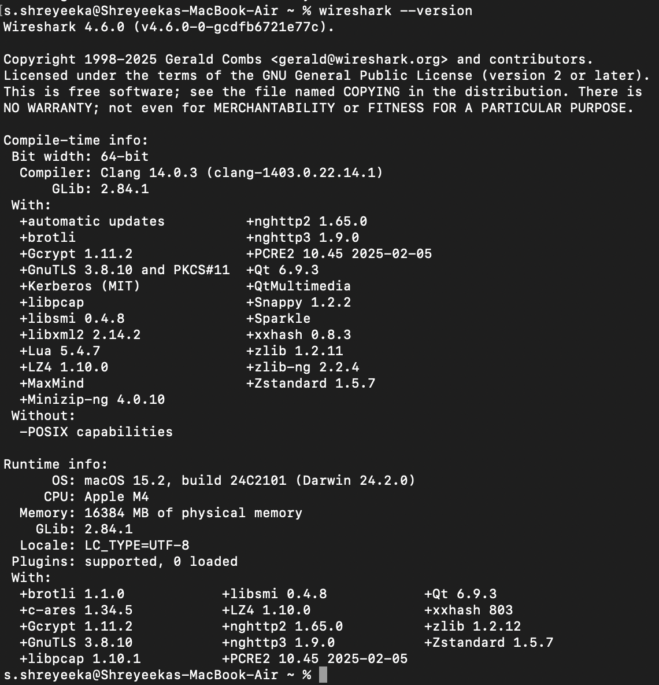
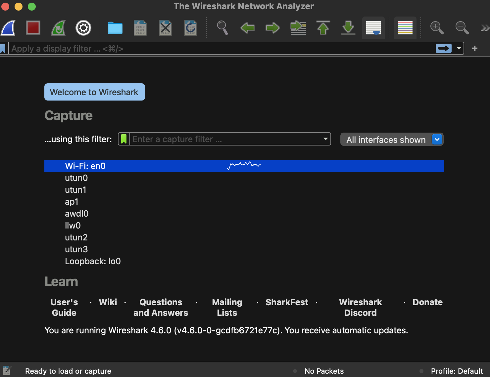
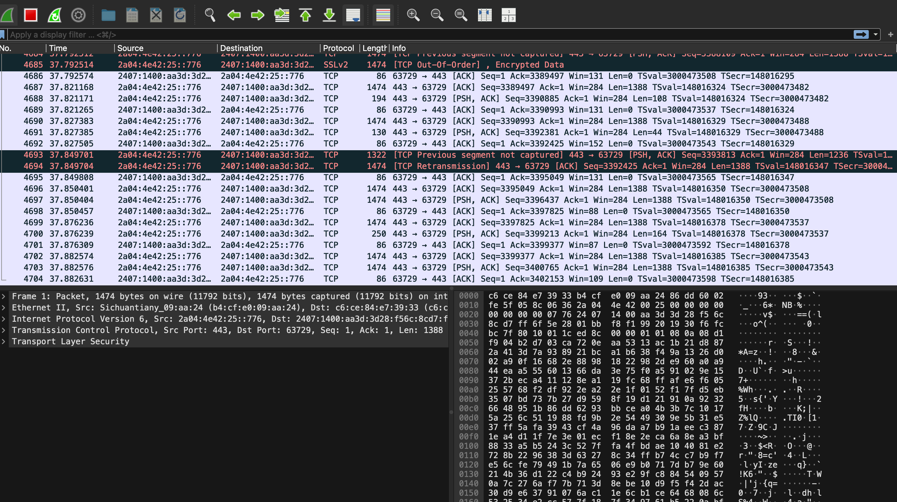
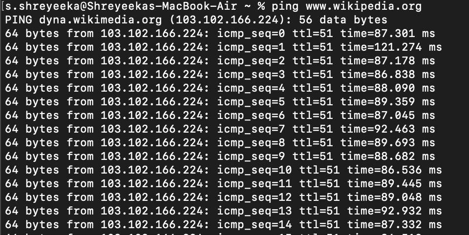
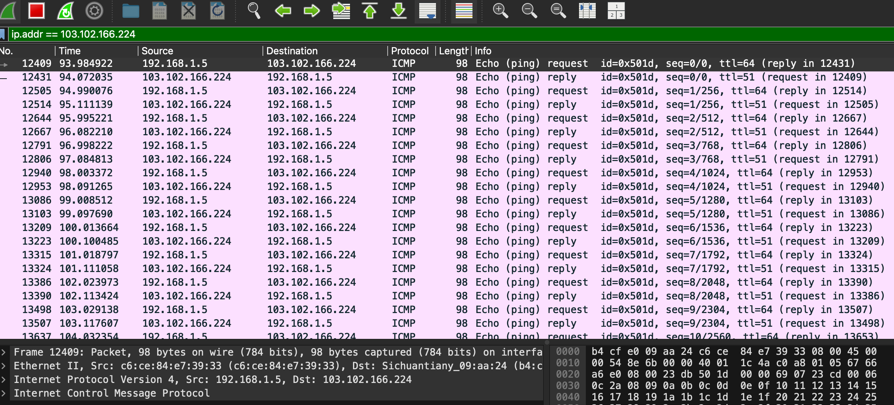
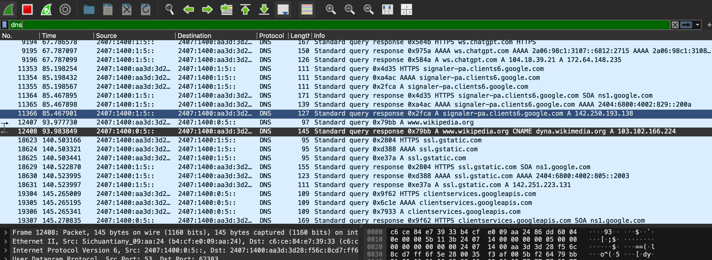
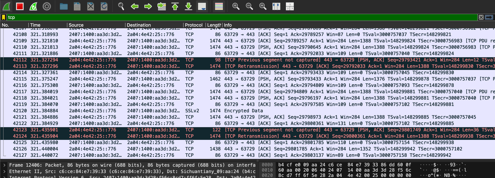
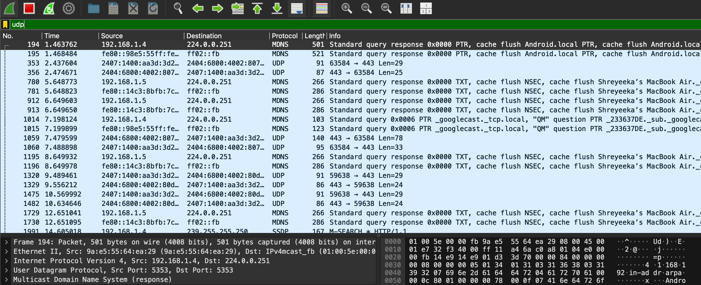

# Task 5 : Capture and Analyze Network Traffic Using Wireshark.

## Objective:
Capture live network packets and identify basic protocols and traffic types.

## Tools:
- **[Wireshark](https://www.wireshark.org/download.html) (free)**

## Table of contents:
- [Objective](#objective)
- [Install Wireshark](#install-wireshark)
- [Capturing packets](#capturing-packets)
    - [1. Open Wireshark](#1-open-wireshark)
    - [2. Start capturing Active Network Interface](#2-start-capturing-active-network-interface)
    - [3. Live Packet Capture](#3-live-packet-capture)
    - [4. Protocol filter](#4-protocol-filter) 
    - [5. Stop the capture](#5-stop-the-capture)
- [Save capture file (.pcap file)](#save-capture-file-pcap-file)
- [Findings and Summary](#findings-and-summary)

## Guide
1. Install Wireshark.
2. Start capturing on your active network interface.
3. Browse a website or ping a server to generate traffic.
4. Stop capture after a minute.
5. Filter captured packets by protocol (e.g., HTTP, DNS, TCP).
6. Identify at least 3 different protocols in the capture.
7. Export the capture as a .pcap file.
8. Summarize your findings and packet details.

---

## Install Wireshark
- **Go to https://www.wireshark.org/download.html**
- **Download and install Wireshark for macOS (or Windows/Linux if applicable)**
- **To verify installation, open terminal and run:**
    - wireshark --version

---

## Capturing packets
### 1. Open Wireshark 

### 2. Start capturing Active Network Interface
- In Wireshark, double-click the active interface (usually en0).
- Wireshark will immediately start showing packets scrolling live, that's our network traffic being captured in real time.

### 3. Live Packet Capture
- While capture is running, create some network activity:
   1. Open a few websites (e.g, google.com, youtube.com)
   2. Or run a ping command as
      - ping google.com
        
        

- Then, apply 'ip.addr == 103.102.166.224' (i.e, the ip of wikipedia.org) 

### 4. Protocol filter
- **Applied 'dns' filter to view DNS traffic only**

- **Applied 'tcp' filter to view TCP traffic only**

- **Applied 'udp' filter to view UDP traffic only**
 

### 5. Stop the capture
- After about 1 minute, click the red square (■) Stop button at the top.
- We'll see all captured packets frozen in the list     

---

## Save capture file (.pcap file)
- File: [Network_capture.pcap](NetworkCapture.pcapng)

---

### Findings and Summary
- During the Wireshark packet capture, multiple types of network traffic were observed while browsing websites and running basic network commands.
- The analysis revealed communication between my computer and several external servers, showing how data travels through various layers of the TCP/IP model.
- Wireshark successfully captured live network traffic on the active Wi-Fi interface.

- **🔍 Key Findings:**
1. DNS Queries: The system sent DNS requests to resolve domain names (e.g., google.com) into IP addresses. This confirmed that name resolution occurs before HTTP communication.
2. TCP Handshake: The three-way handshake process (`SYN`, `SYN-ACK`, `ACK`) was visible in the TCP streams, verifying connection establishment between devices.
3. ICMP Packets: Ping (ICMP Echo Request and Reply) packets were observed when testing connectivity, confirming network responsiveness.
4. Packet Details: Each packet contained Ethernet, IP, and transport-layer headers, helping visualize encapsulation in real time.

---

## Outcome:
Hands-on packet analysis skills and protocol awareness.